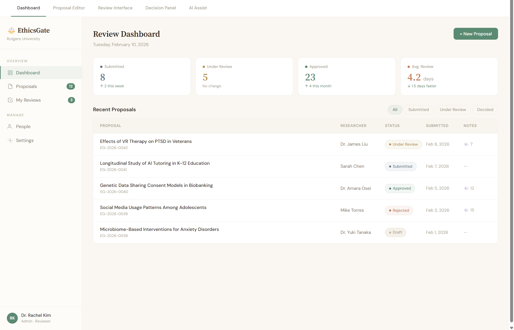
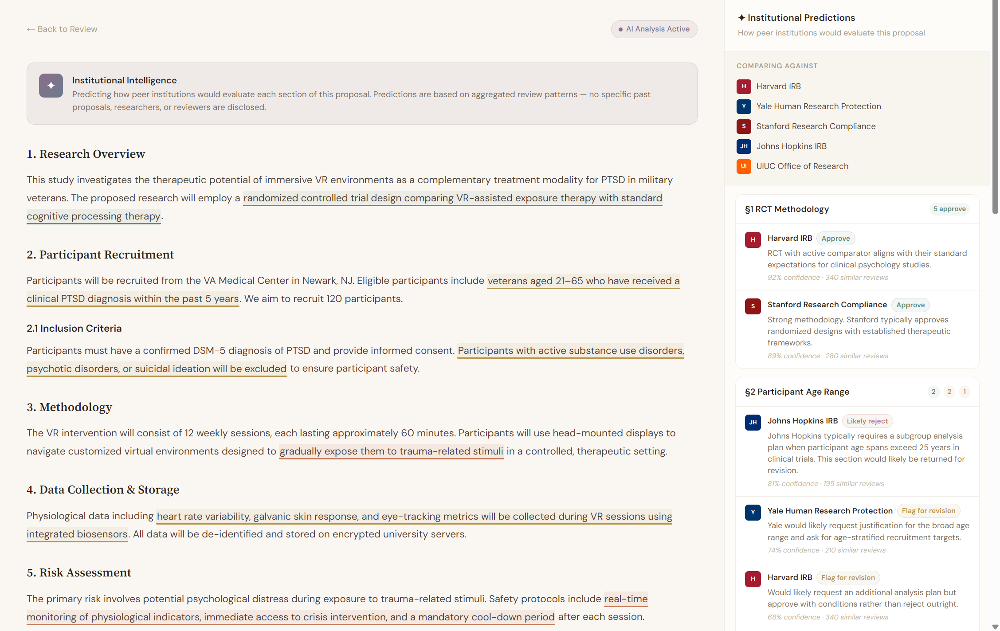
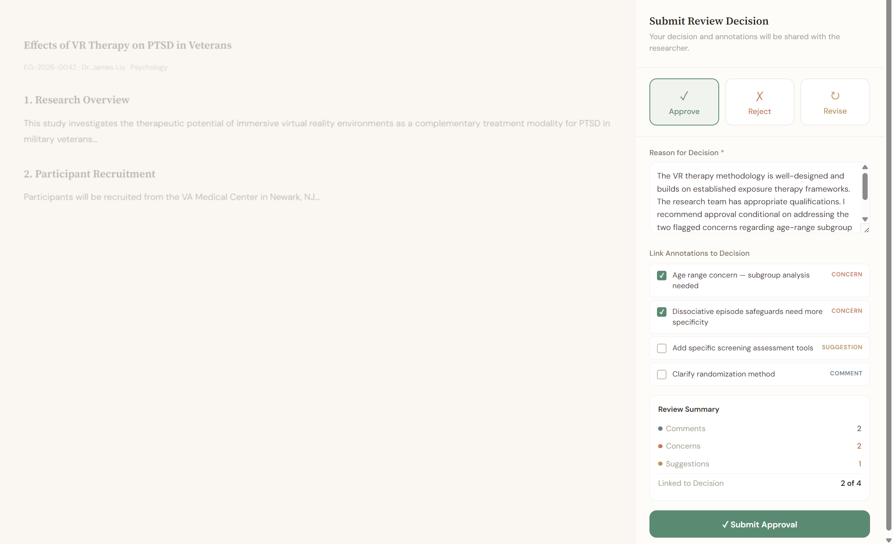

  
  
  

<h1 align="center">⚖️ EthicsGate</h1>

  <strong>Modern IRB Review Platform for Research Institutions</strong>
   
  <em>Streamline ethics review with inline annotations, real-time collaboration, and AI-assisted decision-making.</em>

  <a href="#the-problem">Problem</a> •
  <a href="#features">Features</a> •
  <a href="#screenshots">Screenshots</a> •
  <a href="#tech-stack">Tech Stack</a> •
  <a href="#roadmap">Roadmap</a> •
  <a href="#contact">Contact</a>

---

## The Problem

Institutional Review Boards (IRBs) are the gatekeepers of ethical research — but the tools they use are stuck in the past. Existing solutions like IRBNet, Cayuse, and OneAegis are legacy enterprise platforms with dated interfaces, opaque pricing, and no ability to annotate directly on proposal text. Researchers submit. They wait. They get a PDF with margin notes. The cycle repeats.

**EthicsGate changes this.**

## The Solution

EthicsGate brings the collaborative, real-time review experience of Google Docs to the IRB workflow. Reviewers can highlight, comment, and annotate directly on proposals — color-coded by concern type — and researchers can see feedback in context, respond in threaded conversations, and resubmit revisions without losing history.

## Features

### 🔍 Inline Annotation Review System

The core differentiator. Reviewers select text and choose from three annotation types:

- 🔵 **Comments** — General observations and notes
- 🔴 **Concerns** — Ethical issues requiring attention
- 🟡 **Suggestions** — Recommended changes or additions

Each annotation supports threaded replies, resolution tracking, and links to final review decisions.

### 📋 Proposal Lifecycle Management

- Rich text editor for proposal authoring
- File attachments (PDF, DOCX, images)
- Status pipeline: `Draft → Submitted → Under Review → Decision`
- Revision cycles with full history preservation

### ✅ Structured Decision Workflow

- Approve, Reject, or Request Revisions — with mandatory written rationale
- Link specific annotations to decision reasoning
- Annotation summary dashboard before final submission
- Email notifications at every status change

### 👥 Multi-Tenant Organization Management

- Institution-level data isolation
- Role-based access: Researcher, Reviewer, Admin
- Admin dashboard with review analytics
- User invitation and management system

### 🤖 AI-Powered Institutional Intelligence *(Phase 2)*

The AI layer learns how **your institution** reviews — and predicts how **other institutions** would respond to the same proposal.

- **Institution-specific predictions** — AI highlights specific sections and predicts how named peer institutions would evaluate them. For example: *"Stanford IRB would likely approve this methodology"* or *"Johns Hopkins IRB would likely flag this section for revision based on their consent documentation standards."*
- **Inline risk highlighting** — Color-coded overlays on proposal text showing which sections would pass, get flagged, or get rejected at each institution
- **Cross-institutional comparison view** — Side-by-side breakdown showing how multiple peer institutions would each respond to the same proposal, section by section
- **Privacy-first design** — All predictions are built from aggregated, anonymized review patterns. The AI never reveals which specific past proposal, researcher, or reviewer informed its analysis. Institutions see trend data, not case data.
- **Confidence scoring** — Every institution-level prediction includes a confidence percentage and sample size so reviewers can weigh AI suggestions appropriately

## Screenshots

> 📸 *Concept mockups — see `/docs/mockups/` for the interactive prototype*

| Dashboard | Proposal Review | Decision Panel |
|:---------:|:---------------:|:--------------:|
|  |  |  |

## Tech Stack

| Layer | Technology | Purpose |
|-------|-----------|---------|
| **Frontend** | Next.js 14 (App Router), TypeScript | Server and client rendering, routing |
| **UI** | Tailwind CSS, shadcn/ui | Component library and styling |
| **Rich Text** | Tiptap (open-source core) | Proposal editor, custom annotation marks |
| **Database** | Supabase (PostgreSQL) | Multi-tenant data, Row Level Security |
| **Auth** | Supabase Auth | Magic link and password authentication |
| **Storage** | Supabase Storage | File attachments (PDF, DOCX) |
| **Email** | Resend | Transactional notifications |
| **AI** *(Phase 2)* | OpenAI / Claude API, pgvector | Embeddings, institutional pattern classification |
| **Hosting** | Vercel, Supabase Cloud | Frontend and backend deployment |

## Roadmap

### Phase 1 — Core Platform

- [ ] Multi-tenant auth and organization management
- [ ] Proposal creation with rich text editor
- [ ] Inline annotation system (comment, concern, suggestion)
- [ ] Review decision workflow (approve, reject, revise)
- [ ] Status tracking and email notifications
- [ ] File attachment support
- [ ] Mobile responsive design

### Phase 2 — AI Layer

- [ ] Historical decision embedding pipeline
- [ ] One-click AI review assist with risk highlighting
- [ ] Institution-specific approval and rejection predictions
- [ ] Cross-institution comparison engine (anonymized, opt-in)
- [ ] AI confidence scores with sample size transparency

### Phase 3 — Scale and Enterprise

- [ ] Cross-institution benchmarking dashboard
- [ ] SSO and SAML integration
- [ ] Custom review rubrics and templates
- [ ] API for integration with existing university systems
- [ ] PDF and DOCX import with auto-parsing
- [ ] Multi-round review cycles with diff view
- [ ] Audit trail and compliance logging

## License

Proprietary — © 2026 Anthony Chen & Valarie Wu. All rights reserved.

---

  <strong>Built with ❤️ by <a href="https://anthonymiles.xyz">Anthony Chen</a></strong>
   
  <em>Making ethics review faster, transparent, and smarter</em>

